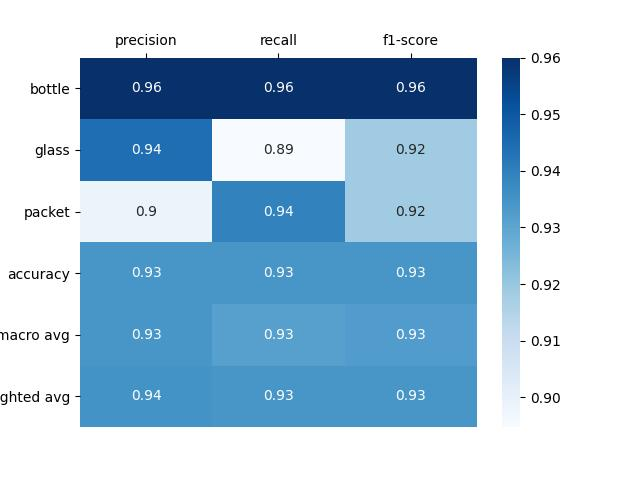
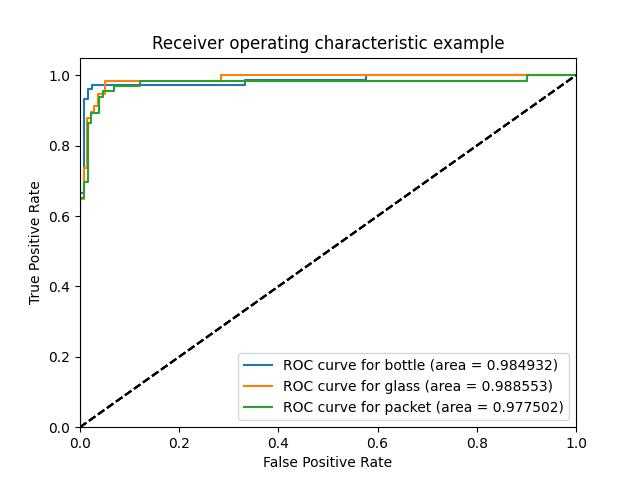

# Classification of Japan items

**This project shows how you can train a model to classificate Japan items into three classes.**

## Getting started

1. Create new environment and activate it:
```
$ conda create --name <env_name> python=3.8
$ conda activate <env_name>
```
2. Download and install all required packages:
```
$ conda install --file requirements.txt
```
3. Run Tensorboard to track results:
```
$ cd <project_name>
$ tensorboard --logdir runs\train
```
4. Run train.py:
```
$ python train.py
```

## Some examples of data


## TensorBoard

In TensorBoard, we can track loss, accuracy, and draw correct and incorrect model predictions.


## Inference

1. After training the model, it should be converted to a .jit format using **src\utils\save_jit.py**.
2. After that, you can run a script that preprocesses the image, inferens the model, and postprocesses the result.
```
$ python --jit_path <path_to_jit_model.jit> --image_path <path_to_image> inference.py
```

## Results

For multiclass classification, useful metrics are Precision, Recall, F1 Score, ROC_AUC.


